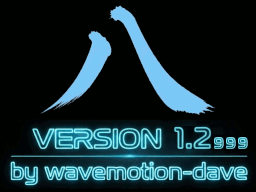
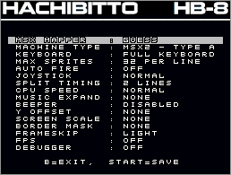
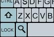
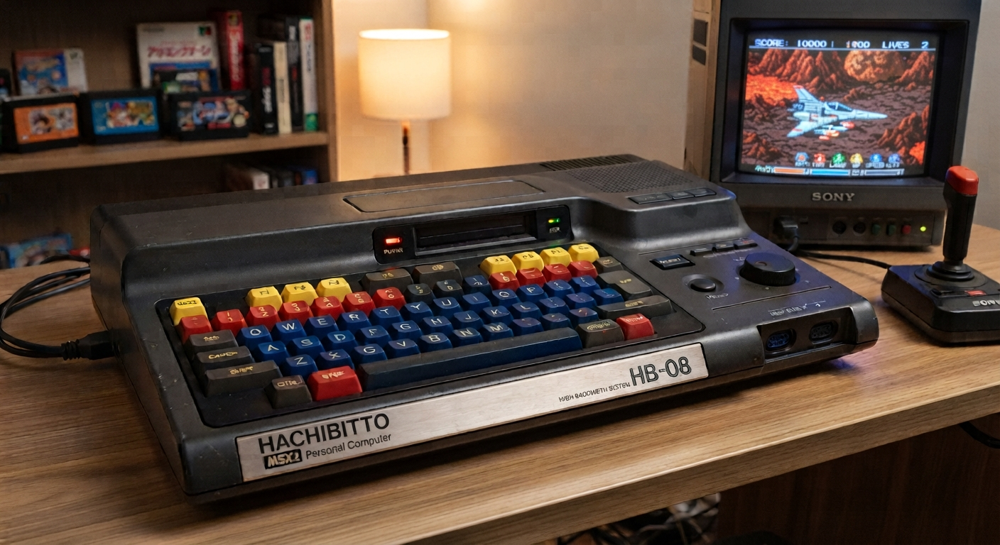
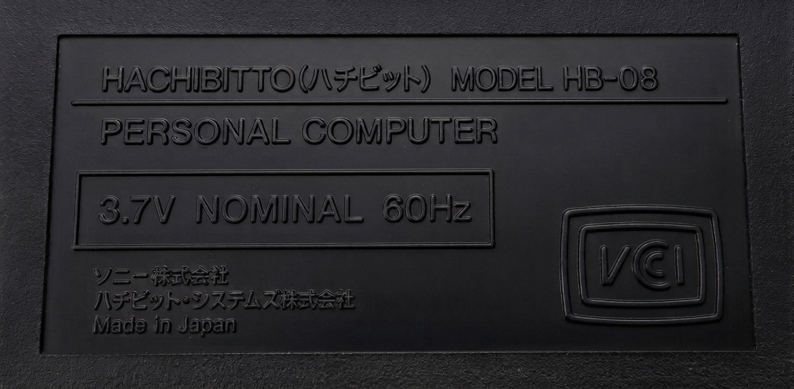
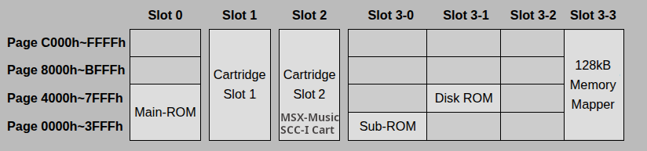
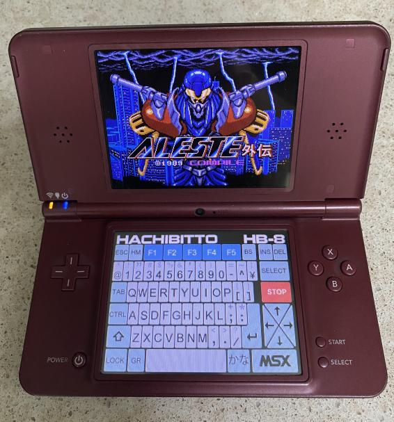

# Hachibitto - MSX2 Emulator

Welcome to Hachibitto (pronounced Ha-Chi-Bee-Toe). A Fantasy MSX/MSX2 Console for your DS/DSi/XL/LL handheld.

# Donations Welcome (but never required!)

These hobby emulators have been a labor of love. An embarassing amount of development time has gone into it as I've strived to provide an enjoyable retro experience on the DS handheld. It's free to use and always will be, however if you feel inclined to buy me a virtual coffee for the effort, that would be beyond amazing!

Features :
-----------------------
* Rock-solid 60Hz sync to the DSi/XL/LL for a tear-free experience (DS-Lite/Phat supported with light frameskip).
* Loads .ROM cartridge files up to 1MB (DS-Lite/Phat) or 4MB (DSi). 
* Two cart slots supported (if a 2nd cart is utilized, it cuts the max .ROM filesizes above in half).
* Loads .DSK disk files that are single side (360K) or double sided (720K) with in-game disk swap.
* Emulated machine is 128K of User RAM and 128K of VRAM.
* Fully configurable keys for the 12 NDS keys to any combination of joystick/keyboard.
* Save and Restore states so you can pick up where you left off on a per-game basis.
* Standard PSG, 2x PSG, SCC, SCC+ and FM-PAC (MSX-MUSIC + SRAM) available.
* SRAM carts backed to SD card automatically.
* Slide-n-Glide style Joystick configuration to make climbing ladders in games like Chuckie-Egg more forgiving (try it - you'll like it!).
* Arkanoid paddle controllers supported (only 2 games known to make use of it - hold B button to speed up paddle movement).
* High Score saving for 10 scores with initials, date/time.
* Favorites list so you can mark games as 'like' or 'love' - a yellow or red heart icon will mark your favorite games.
* Solid Z80 core that passes the ZEXDOC test suite (covering everything except undocumented flags which are partially supported for the few games that need them).
* Minimal design aesthetic - pick game, play game. Runs unpatched from your SD card via TWL++ or similar.

Copyright :
-----------------------
Hachibitto is Copyright (c) 2026 Dave Bernazzani (wavemotion-dave)

As long as there is no commercial use (i.e. no profit is made),
copying and distribution of this emulator, it's source code
and associated readme files, with or without modification, 
are permitted in any medium without royalty provided this 
copyright notice is used and wavemotion-dave (Hachibitto),
and Marat Fayzullin (fMSX core) are thanked profusely.

The sound driver (ay38910 and scc) are libraries from FluBBa (Fredrik Ahlström) 
and those copyrights remain his.

lzav compression (for save states) is Copyright (c) 2023-2025 Aleksey 
Vaneev and used by permission of the generous MIT license.

The MSX/MSX2 logos are used without permission but with the maximum
of respect and love.

The Hachibitto emulator is offered as-is, without any warranty.

Special Thanks :
-----------------------
Thanks to Flubba for the AY38910 and SCC sound cores. You can seek out his latest and greatest at https://github.com/FluBBaOfWard

Also thanks to Marat Fayzullin, as the author of fMSX - which is where the CZ80 CPU core and initial VDP9938 handling came from.

And Nishi.

Options :
-----------------------

* MSX Mapper - Generally leave as 'GUESS' as it will search the internal database (10,000 games) and if not found will attempt to determine the mapper from the ROM size/contents. 
* Machine Type - Usually leave this as the normal MSX2 machine type. Switch to MSX1 Legacy if you want to force the MSX1 VDP handling for a few games that don't play well with MSX2.
* Keyboard Type - Usually full keyboard layout but you can select the simplified Alpha keyboard which helps when playing text-heavy games that need a lot of key input.
* Max Sprites - Normally real hardware can only render 4/8 sprites per line (MSX1 legacy vs MSX2) but the emulation allows all 32 to be displayed without flicker.
* Auto Fire - can be set for Button 1 and/or Button 2.
* Joystick - Generally leave at 'Normal' but can be set to 'Diagonals' for Q-Bert games or 'Slilde-n-Glide' to help make turns onto ladders easier for games like Chuckie Egg. 
* Split Timing - The horizontal line interrupt split is tricky in emulation. To help avoid visual artifacts, this can be set to smooth over 1 or 2 lines. Play with it if you see visual artifacts on the split between static/score area and scrolling area on any game.
* CPU Speed - Generally leave at 'Normal' but you can boost any game by 10% or 20% to give more CPU cycles per line while maintaining the same VDP interrupt rate. Helps games like Aleste and Zanac from slowing down.
* Music Expand - Can use this to enable SCC+ simulated cart (for Snatcher) or MSX-MUSIC for the games that take advantage of it. Many games will auto-configure.
* Beeper - some "lazy" ZX Spectrum ports still use the 1-bit speaker output. It costs emulated CPU time so it's not universally enabled. 
* Y-Offset - used to shift the screen up or down. Even easier is to use the Right Shoulder Button + UP/DOWN on the d-pad to shift the screen.  Buttons X/Y will pan up or down.
* Screen Scale - can be used to compress 212 scanline games down to 192. Generally recommended to use Pan UP/DOWN instead as compression will obviously drop some scanlines.
* Border Mask - can be used to hide the left/right 8 pixels so games that scroll "choppy" are a bit less visually bothersome.
* Frameskip - on the DSi or above, should default to 'None' and you can leave it there... every game locks in at 60Hz. For the older hardware, some light frameskip is required.

Screen Zoom :
-----------------------
Screen 7 games and Mode 0 with 80 Columns can be very hard to read text on the poor old DS handheld as those modes require twice the normal DS screen resolution. 
To that end, when those modes are active, the not-often-needed Graph (GR) button will turn into a Magnifying Glass icon that you can use to toggle the screen zoom.
When zoomed, use the Left/Right shoulder buttons to pan the screen left and right.

Known Issues :
-----------------------
* MSX-MUSIC is vastly simplified processing so that it will run on the older DS hardware. Sound is passable but nowhere near authentic.

The Hachibitto HB-8 Fantasy Console :
-----------------------

Version History :
-----------------------
Version 1.2 - 05-Oct-2026 by wavemotion-dave
* 80 Column mode (with zoom) supported.
* Fix for PSG sound filter - it was causing some sounds to be too gritty.
* Japanese Kana keyboard added.
* New Slot layout - more games play (Lubeck with MSX-MUSIC now runs).
* More cleanup and accuracy improvements across the board.

Version 1.1 - 03-Oct-2026 by wavemotion-dave
* Improved speed across the board.
* Fixed screen 8 sprite colors.
* Improved MSX-MUSIC on DSi ... still far from perfect.
* Screen 7 Zoom-and-Pan mode added (magnifying glass).
* Other cleanups and improvements as time permitted.

Version 1.0 - 29-Sep-2026 by wavemotion-dave
* First major version released.
* Hotfix 1.0a with fix for Save Config on DS-Lite/Phat.
* Hotfix 1.0b with new Z80 handling to improve speed 5%

